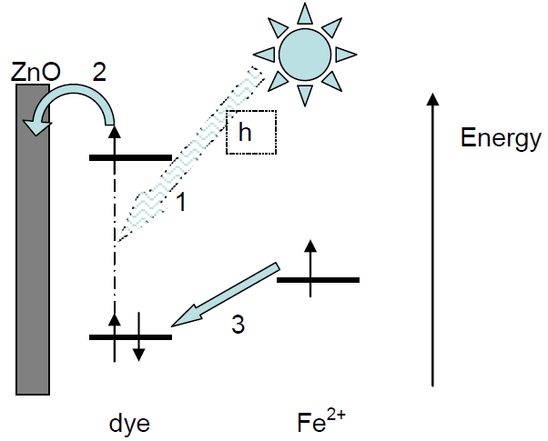

# 吸管太阳能电池

## 教师笔记

吸管太阳能电池是一种很好的教学实验，它让学生在自己学校的实验室中使用便宜易得的材料制造自己的太阳能电池。吸管太阳能电池背后的机理与染料敏化太阳能电池（Dye-Sensitised Solar Cell，DSSC）中使用的机理相似，但使用了不同的电解质和电极材料证实这一概念。 下面概述了实验背后的化学过程。 有关制作电池或采购器材的信息，请分别参阅“说明”和“技术员的说明”文档。

### 化学背景知识

<u>吸管电池</u>

下图是吸管太阳能电池的各个组件及其用途的示意图。

（图片配字有待修为中文）

<u>电池中的半反应方程式</u>

| 半反应方程式                                                 | 电极电位 |
| ------------------------------------------------------------ | -------- |
| $Cu^{2+}_{(aq)} + 2e^{-} \rightleftharpoons Cu_{s}Cu^{2+}_{(aq)} + 2e^{-} \rightleftharpoons Cu_{s}$ | +0.34V   |
| $Fe^{3+}_{(aq)} + e^{-} \rightleftharpoons Fe^{2+}_{aq}$     | +0.77V   |

$$
Cu^{2+}_{(aq)} + 2e^{-} \rightleftharpoons Cu_{s}
$$

$$
Fe^{3+}_{(aq)} + e^{-} \rightleftharpoons Fe^{2+}_{aq}
$$

初始状态下，电池含有Fe2 +和Cu2 +离子，由于它们的相对电极电势，它们不会相互反应。 

<u>工作电极</u>

当增感染料（即与焊丝工作电极上的ZnO层结合的覆盆子汁）吸收日光时，该过程从工作电极开始（箭头1）。吸收了光能的覆盆子染料的电子激发到更高的能级，然后电子从那里注入ZnO半导体（箭头2），并在电路中传播到铜线，在铜线中与Cu2+离子结合形成铜金属。 

同时，氧化的覆盆子染料被溶液中的Fe2+离子再次还原形成Fe3+离子（箭头3）。现在，电池中有Fe3+离子，由于合适的电极电位，可以与Cu金属反应。该反应可再生Fe2+和Cu2+离子。这样，当吸收更多的光能时，整个过程就可以再次开始。 氢氧化钠溶液用作基底电解质溶液，以增加电池内电解质的电导率。 

### 实验过程中

<u>电镀工作电极</u> 🚧

首先将焊锡丝放在装有甲基化酒精（溶剂），硫酸锌（ZnSO4），铝箔，铵溶液（NH4OH）和一小片焊锡丝的试管中放置10分钟。 

使用醇溶剂是因为与使用水作为溶剂相比，它可以产生更好的半导体晶体结构和较小的晶体尺寸。 

氨溶液有助于使Zn（来自ZnSO4）和Sn（来自焊锡丝）更易溶于甲基化酒精。ZnSO4还与氢氧化铵反应生成Zn（OH）2。所有这些都会使焊丝线圈镀上一层锌膜。铝箔的存在有助于将Al作为杂质引入，请参阅稍后。 

### 扩展

由本实验可以设计出一些相关的研究项目。 下面是一些参考方向。 

- 改变吸管的颜色。使用不同的有色吸管的电池会有不同的电压和电流值，因为它们没有吸收相同的太阳光谱的部分。 
- 更换染料。许多种类的水果和蔬菜都含有合适的染料分子（花青素）。 
- 改变照射在电池上的光强。 
- 改变对电极/工作电极的表面积比值。
- 调查其他合适的电解质化合物。
- 将电池机理与标准染料敏化太阳能电池进行比较。 

### 与其他课程的联系

- 光学：光的吸收，色彩
- 电学：串并联电路，电压与电流，电化学，电极电位，反应性
- 可再生能源：太阳能，能量储存，设计新技术时的安全与可行性考虑

### 安全

### 参考资料

本实验改编自一篇期刊论文。原始论文载于:

S.J. Appleyard, Physics Education, Volume 3, Issue 3, May 2008, pages 270-279.